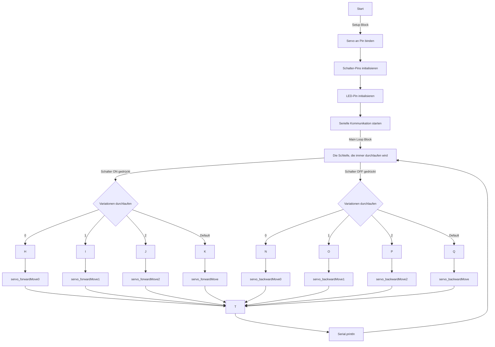

# UselessBox

## Was ist das alles?
Einfaches Projekt zur Veranschaulichung verschiedener Technologien.

Da [nichts einen Sinn hat und es auch keinen Wert gibt](https://de.wikipedia.org/wiki/Nihilismus), habe ich auch ein sinnloses Projekt ausgewählt. Die **[uselessBox](https://de.wikipedia.org/wiki/Leave-Me-Alone-Box)** . Manche nennen es auch die **Leave-Me-Alone-Box**.
## Was ist notwendig?
Zur Bewältigung des Projektes sind Kenntnisse in 3D-Konstruktion, Montage, Elektronik, 3D-Druck, und Softwareentwicklung notwendig. Hört sich erst mal schlimm an, ist aber überschaubar.
### Verwendete Software
Da für so ein Projekt viele verschiedene Aufgaben erledigt werden müssen, werden auch sehr unterschiedliche Programme benötigt.
#### CAD-Programm
Die 3D-Modelle für die Box werden in einem [CAD](https://de.wikipedia.org/wiki/CAD)-Programm erstellt. Dazu verwende ich eines der folgenden:
- [FreeCAD](https://www.freecad.org/index.php?lang=de)
- [Autodesk Fusion 360](https://www.autodesk.com/de/products/fusion-360/)
#### Slicer
Das 3D-Modell wird in einem [CAM](https://de.wikipedia.org/wiki/Computer-aided_manufacturing)-Programm, dem [Slicer](https://de.wikipedia.org/wiki/Slicer-Software), in [G-Code](https://de.wikipedia.org/wiki/Computerized_Numerical_Control#DIN/ISO-Programmierung_bzw._G-Code) umgewandelt. Dazu kann man aus vielen wählen, ich bevorzuge:
- [Prusa Slicer][https://www.prusa3d.com/]
- [Orca Slicer](https://orca-slicer.com/)
#### Entwicklungsumgebung
Die Software für den [Mikrocontroller](https://de.wikipedia.org/wiki/Mikrocontroller) der **[uselessBox](https://de.wikipedia.org/wiki/Leave-Me-Alone-Box)** wird in einer Entwicklungsumgebung geschrieben. Meine Auswahl:
- [Arduino IDE](https://de.wikipedia.org/wiki/Arduino_IDE) 
- [VS Code](https://code.visualstudio.com/) mit [Platform IO](https://platformio.org/)
#### Informationssammlung
[Obsidian](https://obsidian.md/download)
### Verwendete Werkzeuge
- Lötkolben
- Schneidzange
- Mehrzweckmesser
- Feuerzeug
- [3D-Drucker](https://de.wikipedia.org/wiki/3D-Druck) nach dem [FDM-Prinzip](https://de.wikipedia.org/wiki/Fused_Deposition_Modeling)
### Verbrauchsmaterial
- [Haftvermittler](https://de.wikipedia.org/wiki/Haftvermittler) Haarspray (da [PVA](https://de.wikipedia.org/wiki/Polyvinylacetat)-basiert)
- [Werkstoff]([Material](https://de.wikipedia.org/wiki/Werkstoff)) 3D-Drucker [Filament](https://de.wikipedia.org/wiki/Filament_(3D-Druck))
- [Lötzinn](https://de.wikipedia.org/wiki/Lot_(Metall))
- [Flussmittel](https://de.wikipedia.org/wiki/Flussmittel_(L%C3%B6ten))
### Benötigte Kaufteile

| Anzahl | Bezeichnung                                                             | Pinzahl | Rastermaß (mm) | Beschreibung | Genauer Typ / Bezeichnung / Google-Suche    |
| ------ | ----------------------------------------------------------------------- | ------- | -------------- | ------------ | ------------------------------------------- |
| 1      | [Kippschalter](https://de.wikipedia.org/wiki/Schalter_(Elektrotechnik)) | 3       |                | 2 Stellungen | Miniatur-Kippschalter, EIN-EIN, 3 A / 250 V |
| 1      | [Servo](https://de.wikipedia.org/wiki/Servo)                            |         |                | 9g           | SG90 9g Micro Servomotor                    |
| 1      | [Arduino UNO](https://de.wikipedia.org/wiki/Arduino_(Plattform))        |         |                |              | Arduino Uno Rev3                            |
| 2      | [Stiftleiste](https://de.wikipedia.org/wiki/Stiftleiste)                | 4       | 2,54           | 90°          | Stiftleiste   RM 2,54mm, gewinkelt, 1x4     |
| 1      | [Buchsenleiste](https://de.wikipedia.org/wiki/Stiftleiste)              | 3       | 2,54           |              | Buchsenleiste RM 2,54mm, gerade,    1x3     |
### Benötigte 3D-Druck-Teile

| Anzahl | Bezeichnung |
| ------ | ----------- |
| 1      | Dose        |
| 1      | Deckel_1    |
| 1      | Deckel_2    |
| 1      | Hebel       |
| 1      | Drehsperre  |
## Grober Ablauf
- Überlegen was passieren muss.
- Es wird ein Gehäuse benötigt das alle Teile aufnimmt.
- Die Teile sollen mit möglichst wenig Werkzeug, Schrauben, oder andere Zusatzteile zusammengebaut werden können.
## Fertigen der Bauteile
### Fertigen der Teile auf dem Drucker
4. Das 3D-Modell wurde in einem [CAD](https://de.wikipedia.org/wiki/CAD)-Programm erstellt.
5. Das 3D-Modell wurde in einem [CAM](https://de.wikipedia.org/wiki/Computer-aided_manufacturing)-Programm, dem [Slicer](https://de.wikipedia.org/wiki/Slicer-Software), in [G-Code](https://de.wikipedia.org/wiki/Computerized_Numerical_Control#DIN/ISO-Programmierung_bzw._G-Code) umgewandelt. Das kann in Prusa Slicer oder Orca Slicer erfolgen.
6. Der 3D-Drucker ist eine [CNC](https://de.wikipedia.org/wiki/Computerized_Numerical_Control)-Maschine, die Anweisungen (CNC-Programm) in Form von  [G-Code](https://de.wikipedia.org/wiki/Computerized_Numerical_Control#DIN/ISO-Programmierung_bzw._G-Code) empfängt.
7. Der [G-Code](https://de.wikipedia.org/wiki/Computerized_Numerical_Control#DIN/ISO-Programmierung_bzw._G-Code) wurde mit [Octoprint](https://de.wikipedia.org/wiki/OctoPrint) an den [3D-Drucker](https://de.wikipedia.org/wiki/3D-Druck) übertragen.
8. Der [3D-Drucker](https://de.wikipedia.org/wiki/3D-Druck) nutzt als Betriebssystem oft [Marlin](https://marlinfw.org/) oder [Klipper](https://www.klipper3d.org/) und fertigt anhand des [G-Code](https://de.wikipedia.org/wiki/Computerized_Numerical_Control#DIN/ISO-Programmierung_bzw._G-Code)s und [Material](https://de.wikipedia.org/wiki/Werkstoff) ein Objekt.
9. [Supports](https://help.prusa3d.com/de/article/stutzstrukturen_1698) entfernen.
10. [Nacharbeit](https://de.wikipedia.org/wiki/Rework) der Teile.
### Fertigen der elektronischen Bauteile
Die [elektronischen Bauteile](https://de.wikipedia.org/wiki/Liste_elektrischer_Bauelemente) werden durch [Steckverbinder](https://de.wikipedia.org/wiki/Steckverbinder) und [Löten](https://de.wikipedia.org/wiki/L%C3%B6ten) verbunden. 
11. [Stiftleisten](https://de.wikipedia.org/wiki/Stiftleiste) aussuchen.
12. Kabel anlöten.
13. [Buchsenleiste](https://de.wikipedia.org/wiki/Stiftleiste) an [Kippschalter](https://de.wikipedia.org/wiki/Schalter_(Elektrotechnik) anlöten.
## Zusammenbau der Bauteile
14. Deckel an Gehäuse anbringen.
15. Achsen einschmelzen.
16. [Arduino UNO](https://de.wikipedia.org/wiki/Arduino_(Plattform)) einsetzen.
17. [Arduino UNO](https://de.wikipedia.org/wiki/Arduino_(Plattform)) einschrauben.
18. [Stiftleisten](https://de.wikipedia.org/wiki/Stiftleiste)  mit [I/O-Pins](https://de.wikipedia.org/wiki/GPIO) verbinden.
19. [[Servo]] in Drehsperre einsetzen.
20. Hebel an [[Servo]] anbringen.
21. Drehsperre in Gehäuse einsetzen.
22. [[Servo]] in Drehsperre und Gehäuse einschieben.
23. [Kippschalter](https://de.wikipedia.org/wiki/Schalter_(Elektrotechnik)) in Deckel einsetzen.
24. [I/O-Pins](https://de.wikipedia.org/wiki/GPIO) mit [[Servo]] verbinden.
25. [I/O-Pins](https://de.wikipedia.org/wiki/GPIO) mit [Kippschalter](https://de.wikipedia.org/wiki/Schalter_(Elektrotechnik)) verbinden.
## Schreiben des Programmes
26. Die Software für den [Mikrocontroller](https://de.wikipedia.org/wiki/Mikrocontroller) der **[uselessBox](https://de.wikipedia.org/wiki/Leave-Me-Alone-Box)** wird in der [Arduino IDE](https://de.wikipedia.org/wiki/Arduino_IDE) und/oder [VS-Code](https://de.wikipedia.org/wiki/Visual_Studio_Code) mit [PlatformIO](https://de.wikipedia.org/wiki/PlatformIO) entwickelt.
27. Die entwickelte Software wird durch ein [USB-Kabel](https://de.wikipedia.org/wiki/Universal_Serial_Bus) auf den [Mikrocontroller](https://de.wikipedia.org/wiki/Mikrocontroller) geschrieben.

HINWEIS! Das Diagramm ist weder vollständig noch komplett korrekt!
WARNUNG! Je nach Einbauposition des Hebels kann Gehäuse, Arduino oder sonstiges **ZERSTÖRT** werden.
ACHTUNG! Im Programm sind aktuell die **Endpositionen** von **90 und 160** vorgesehen! wenn der **Servo** auf der **hinteren Endlage** steht, muss der **Hebel** in etwa **horizontal** angebracht werden!
ACTHUNG! Hardware-Projekte und Software-Projekte können NICHT beliebig abgeändert oder kombiniert werden!

HINWEIS: Vor dem verwenden neuer Software IMMER den Servo ausbauen! (Siehe Video)

## Fehlerbehebung
Die üblichen Verdächtigen:
- Kabel richtig gesteckt?
- Hebel in der richtigen Position/Ausrichtung angebracht?

